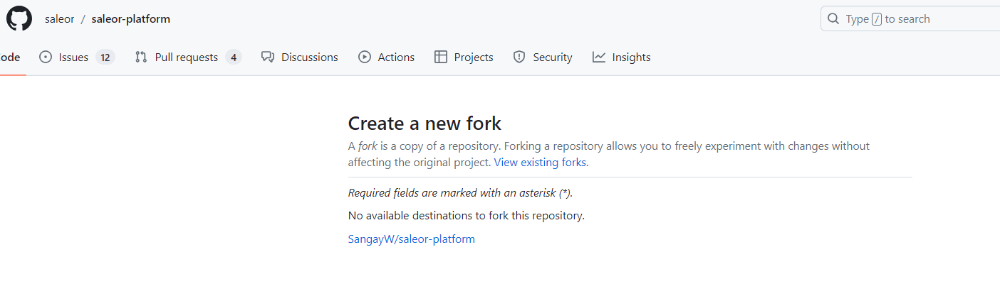
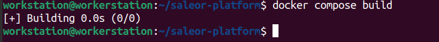
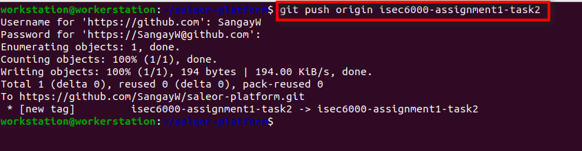
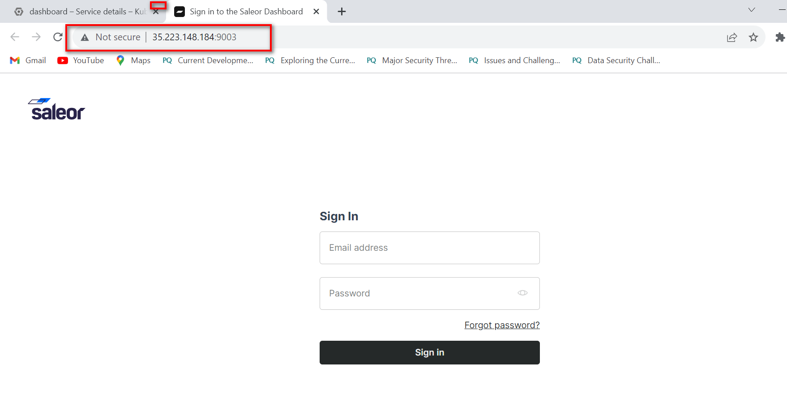

**Task2: Microservices Architecture and Deployment**

1.  **Fork Repository**

<!-- -->

1.  <https://github.com/saleor/saleor-platform> repository which
    contains essential Docker Compose elements for configuring,
    building, and executing Saleor components.

2.  **Clone forked repository into local machine.**

<!-- -->

1)  Copy <https://github.com/SangayW/saleor-platform.git> and then below
    command in the local machine terminal.

- git clone <https://github.com/SangayW/saleor-platform.git>

>  alt="A screenshot of a computer Description automatically generated" />

2)  Change directory to cloned directory.

- cd saleor-platform

3)  Build the application

- docker compose build

4)  Apply Django migrations:

- docker compose run --rm api python3 manage.py migrate

5)  Populate the database with example data and create the admin user.

- docker compose run --rm api python3 manage.py populatedb
  –createsuperuser

6)  Run the application

- docker compose up

7)  Results

- Saleor Core (API) - [http://localhost:8000](http://localhost:8000/)

- Saleor Dashboard - [http://localhost:9000](http://localhost:9000/)

- Jaeger UI (APM) - [http://localhost:16686](http://localhost:16686/)

- Mailpit (Test email interface)
  - [http://localhost:8025](http://localhost:8025/)

3.  Pushing the changes to the git i.e. chaned port number for Dashboard
    to 9003

Note: PAT (Personal Access Token) is required while pushing updated code
to git using ubuntu terminal. Below snapshot shows the way to generate
PAT

1.  Go to **Settings** option under your profile.

2.  Go to **Developer Settings**

3.  Select **Personal Access Tokens** option under Developer Settings

4.  Generate by choosing the options given in the snapshot.

Note: Save the generated token in the text file to be used later.

5.  Push the modified code to git

6.  Add tag to the project and push the tag to the git

- git tag -a isec6000-assignment1-task2 -m “tag for the task2 of
  assignment1”

- git push origin isec6000-assignment1-task2

Output after pushing code to the GitHub.

**Deploying the project into the Kubernetes cluster created in the
task1.**

1.  Converting docker compose file to Kubernetes file.

- **Kompose** is the tool that helps to generate Kubernetes resource
  file from the docker compose file without having to write it manually.

- Follow installation instructions given at
  <https://kubernetes.io/docs/tasks/configure-pod-container/translate-compose-kubernetes/>

- Run below command after completing the translation:

  - kubectl apply -f
    api-service.yaml,backend-env-configmap.yaml,common-env-configmap.yaml,dashboard-deployment.yaml,dashboard-service.yaml,db-claim1-persistentvolumeclaim.yaml,db-deployment.yaml,db-service.yaml,jaeger-deployment.yaml,jaeger-service.yaml,mailpit-deployment.yaml,mailpit-service.yaml,redis-deployment.yaml,redis-service.yaml,saleor-backend-tier-networkpolicy.yaml,saleor-db-persistentvolumeclaim.yaml,saleor-media-persistentvolumeclaim.yaml,saleor-redis-persistentvolumeclaim.yaml,worker-deployment.yaml

- Check all the services, secrets and all related resources from the
  Kubernetes cluster that has been created in the task 1.

- Push updated code to git

- To access the service from the Internet, expose dashboard application
  to the Internet by changing Deployment type to LoadBalancer.

